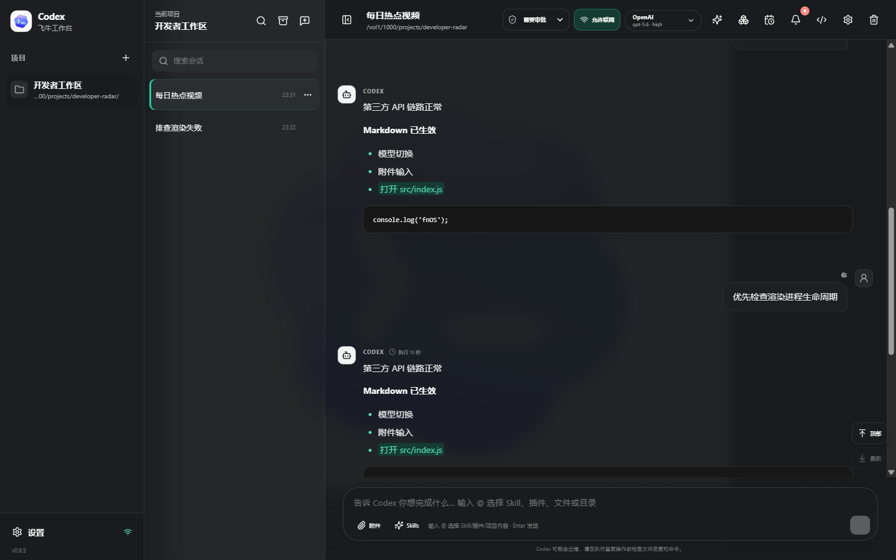
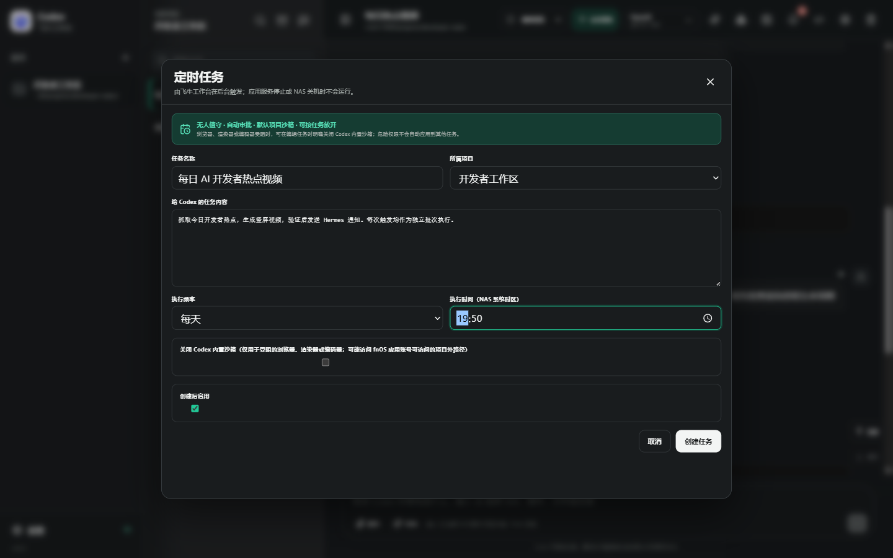
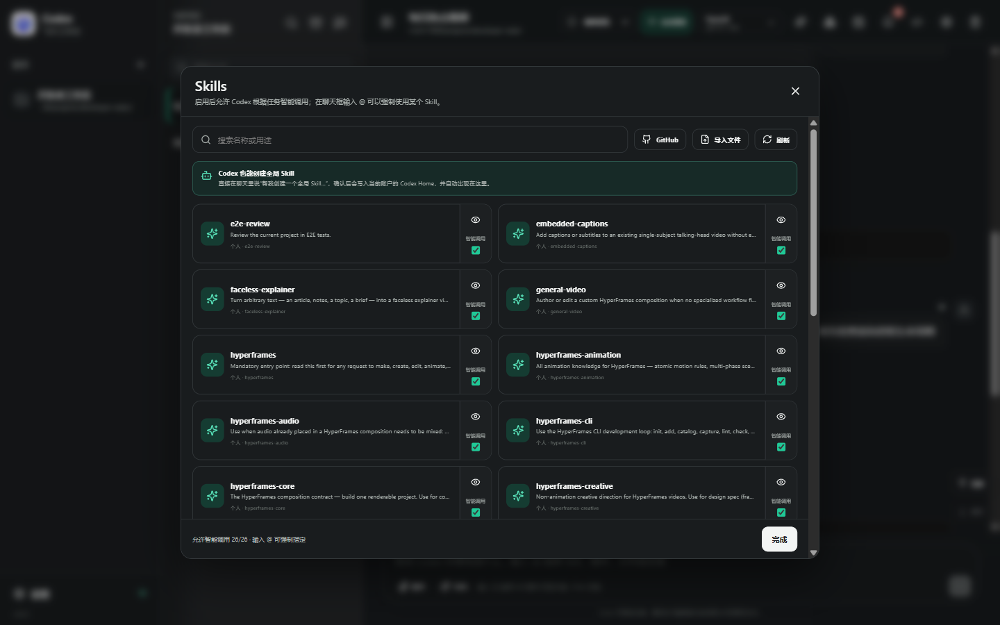
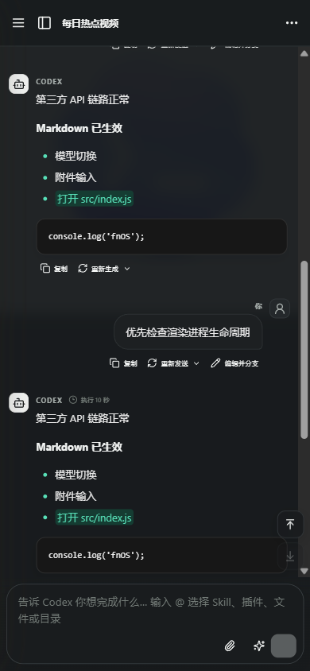
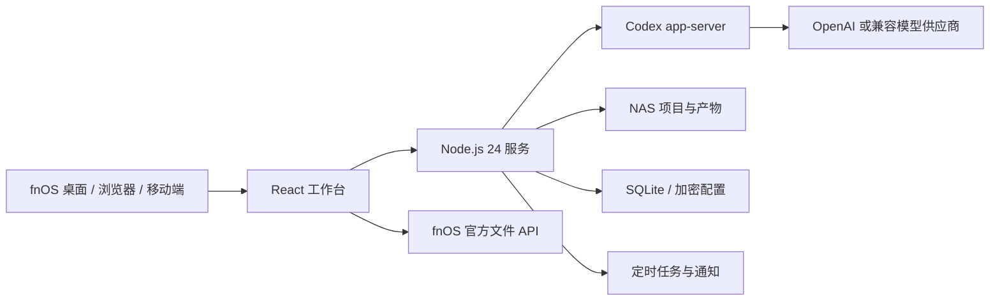

<div align="center">
  
  <h1>Codex 飞牛工作台</h1>
  <p><strong>把 Codex 的项目、会话、自动化与扩展能力，带进 fnOS / NAS 的长期运行环境。</strong></p>
  <p>原生飞牛桌面体验 · 实时对话控制 · 后台定时任务 · Skills 与插件 · 多模型供应商</p>

  <p>
    
    
    
    
  </p>

  <p>
    <a href="https://github.com/lidachui1998/codex-fnos-web/releases/tag/v0.9.5"><strong>下载 v0.9.5 FPK</strong></a>
    ·
    <a href="#快速开始">快速开始</a>
    ·
    <a href="#核心能力">核心能力</a>
    ·
    <a href="#本地开发">参与开发</a>
  </p>
</div>



> [!NOTE]
> 这是面向 fnOS 的独立第三方项目，不是 OpenAI 或飞牛官方产品。项目调用官方 Codex 与飞牛开放平台能力，但不代表任何官方背书。

## 为什么做这个项目

Codex 擅长处理真实项目，但 NAS 场景需要的不只是一个聊天框：项目要长期保存在共享目录，任务要能在后台按时触发，文件要能交给飞牛文件管理器，失败和等待输入还要及时通知到人。

Codex 飞牛工作台把这些环节放进同一个 fnOS 应用：

- 在浏览器、飞牛桌面与移动端管理多个项目和长会话。
- 在回复生成期间选择“立即追加”影响后续回答，或“等待发送”排队自动续上。
- 让 Codex 创建新会话、按任务自主使用子代理，并在不同任务间保持清晰边界。
- 让定时任务、通知、文件预览、Skills、插件和多模型供应商围绕 NAS 项目协同工作。

## 核心能力

| 能力 | 0.9.5 中的实现 |
| --- | --- |
| 实时对话控制 | 流式回答、中断、官方 `turn/steer` 立即追加、等待队列自动发送；队列项也可手动提前发送 |
| 会话管理 | 创建、恢复、重命名、置顶、归档、删除、全局搜索、重新发送、重新生成与编辑并分支 |
| 新会话与子代理 | Codex 可通过工作台入口显式创建新会话；启用原生子代理能力，由 Codex 根据任务决定是否委派 |
| fnOS 后台自动化 | 每隔一段时间、每天或每周执行；每次运行保存为新会话，支持桌面 Codex 自动化导入 |
| NAS 文件工作流 | 项目文件、Git diff 与常见产物预览；调用官方 `openFile` / `openFileManager` 打开或定位文件 |
| Skills 与插件 | 搜索、预览、智能调用、`@` 强制指定；支持 GitHub、`SKILL.md`、ZIP 与标准插件包导入 |
| 模型与账号 | OpenAI / ChatGPT 设备码或 API Key 登录，多账号隔离；第三方 Responses 与 Chat Completions 自动适配 |
| 网络与代理 | 新会话默认允许命令联网，可逐会话关闭；HTTP、HTTPS、SOCKS5 合并配置，供应商可继承、指定或直连 |
| 通知与交付 | fnOS 工作台通知中心、飞书 V2 机器人、Hermes 微信 Webhook，按事件启停并保留准确状态 |
| 安全与持久化 | 首次自设密码、HttpOnly Cookie、工作区边界、路径穿越防护、SQLite、AES-256-GCM 密钥加密 |

<details>
<summary><strong>展开查看更多交互细节</strong></summary>

- 每个会话独立保存模型、思考强度、审批策略、联网开关、草稿、附件、Skills 和滚动位置。
- 重试保持原会话与供应商路由；只有“编辑并分支”会创建派生会话。
- 长会话分段加载，工具执行过程默认折叠，切换会话时取消过期请求并恢复缓存状态。
- 模型请求失败、自动重试和空回复会显示在时间线中，可复制具体错误并从原消息重试。
- `@` 菜单统一搜索已启用 Skills、已安装插件以及当前项目文件和目录。
- 产物中心聚合 HTML、PDF、图片、音视频、压缩包、FPK 和 APK，并隔离打开可执行网页产物。
- 深色、墨色主题与可配置背景支持桌面三栏、窄屏工具栏和移动端抽屉布局。

</details>

## 自动化不是“另一个聊天框”

定时任务由飞牛工作台服务在 NAS 后台触发。默认使用项目可写沙箱并自动审批任务内命令；只有浏览器、渲染器或编码器确实受阻时，才可对单个任务明确关闭 Codex 内置沙箱，不会把高权限扩散到其他任务。



- 支持固定间隔、每天和每周计划，使用 NAS 系统时区。
- 可导入电脑 Codex 的 `automation.toml` 与 `memory.md`，保留 RRULE、模型、思考强度、提示词和记忆。
- Windows 路径、PowerShell、桌面浏览器登录态和原生工具会先做 fnOS 兼容检查；有阻塞时完整保存但自动暂停。
- 每次触发创建独立的新会话，应用停止或 NAS 关机时不会伪装成已执行。
- 任务状态进入通知中心，并可按需转发到飞书或 Hermes。

## Skills、插件与项目上下文



Skills 可以允许 Codex 智能调用，也可以在聊天框中通过 `@` 明确指定。账户级 Skills 与插件跟随对应 Codex 账号隔离；从 GitHub 或 ZIP 导入时会验证目录边界和标准清单，连接器仍需用户单独授权。

## 桌面与移动端

桌面端使用项目栏、会话栏和工作区三栏布局；移动端改为抽屉与紧凑工具栏，保留消息操作、附件、Skills 和会话跳转。

<p align="center">
  
</p>

## 快速开始

### 环境要求

- fnOS，x86_64 架构。
- 应用依赖 `nodejs_v24`，FPK 安装清单会声明该依赖。
- 一个 OpenAI / ChatGPT 账号、OpenAI API Key，或兼容 Responses / Chat Completions 的第三方模型服务。

### 安装 FPK

1. 从 [v0.9.5 Release](https://github.com/lidachui1998/codex-fnos-web/releases/tag/v0.9.5) 下载 `com.lidachui.codexweb-0.9.5-x86_64.fpk`。
2. 在 fnOS 应用中心选择手动安装，并上传 FPK。
3. 打开“Codex 飞牛工作台”，首次使用时设置工作台访问密码。
4. 登录 OpenAI / ChatGPT，或在设置中添加第三方模型供应商。
5. 创建项目并选择 NAS 目录，然后开始新会话。

安装包 SHA-256：

```text
0697B597AD80F7832933924358247EFA911F41365EE96CA297E716C0C40969B2
```

> [!TIP]
> FPK 约 114 MiB，主要因为内置了可在 NAS 上直接运行的 Codex Linux x64 运行时。升级和卸载不会主动删除项目、账号状态或应用密钥。

## 飞牛开放平台集成

- 前端使用飞牛官方 [`@trimjs/web-app`](https://www.npmjs.com/package/@trimjs/web-app)，FPK 声明 `micro_app=true`。
- “使用飞牛打开”和“在文件管理器中定位”分别调用官方 `openFile`、`openFileManager`，不猜测桌面私有 URL 或内部消息协议。
- 通过 fnOS iframe 在当前桌面窗口打开；统一网关可复用 NAS 与 FN Connect 入口的登录态。
- 生命周期会探测飞牛 Docker CLI 并加入 Codex 的 `PATH`。任意控制宿主 Docker 套接字接近 root 权限，因此安装包不会默认静默开放。

## 架构



## 数据与安全

- 默认仅监听 `127.0.0.1:19090`，首次打开由用户设置访问密码。
- 登录使用 HttpOnly Cookie；API Key、代理密码、Webhook 地址和 secret 使用应用主密钥进行 AES-256-GCM 加密。
- 项目文件访问限制在配置的工作区根目录内，并校验真实路径以防止路径穿越。
- 外部通知默认只包含任务名、类型、状态、简短结果或错误，不会自动附带项目文件。
- 删除附加账号时，凭据目录先移动到可恢复隔离区，而不是直接永久删除。
- 应用不会逆向 FN Connect 私有协议、修改飞牛系统数据库，或默认开放 Docker 套接字权限。

## 通知配置

在“设置 → 通知设置”中配置渠道：

- fnOS 工作台通知中心始终启用，通知和未读状态保存在应用 SQLite 中。
- 飞书使用 V2 自定义机器人 Webhook；如果群机器人启用了签名校验，再填写签名 secret。
- Hermes 填写完整 notify 地址和路由 secret；局域网、localhost 和私有 IPv4 地址自动直连，不经过应用默认代理。
- Webhook 地址与 secret 只在服务端加密保存，界面、公开接口和日志仅返回掩码。

## 本地开发

需要 Node.js 24+。

```powershell
npm install
npm run dev
```

常用命令：

```powershell
npm test
npm run build
npm run test:e2e
```

可用环境变量：

| 变量 | 用途 |
| --- | --- |
| `HOST` / `PORT` | 服务监听地址与端口 |
| `DATA_DIR` | SQLite、密钥和 Codex Home 的数据根目录 |
| `WORKSPACE_ROOTS` | 允许创建项目的 NAS 工作区根目录 |
| `CODEX_BIN` | Codex 可执行文件路径 |
| `CODEX_HOME` | 主 Codex 账号目录 |
| `APP_ACCESS_TOKEN` | 兼容旧版调用的内部访问令牌 |

## 构建 fnOS FPK

```powershell
npm pack @openai/codex@linux-x64 --pack-destination vendor-cache
npm run package:fnos
npm run verify:fnos
```

FPK 使用应用 ID `com.lidachui.codexweb` 和端口 `19090`。安装后会创建 `codexweb` 共享目录：

- 项目默认位于 `codexweb/projects`。
- 应用密钥与 Codex 登录信息位于 `codexweb/.codex-system`。
- 升级和卸载不会主动删除这些数据。

## 贡献

欢迎提交问题报告、功能建议和 Pull Request。提交前请至少运行：

```powershell
npm test
npm run build
```

涉及 fnOS 文件、统一网关、Docker 或权限的改动，请优先使用官方 SDK 和公开接口，并在 PR 中说明安全边界与实际验证方式。

## 开源许可状态

当前仓库随 FPK 提供的许可证仍是“保留所有权利、仅供个人 fnOS 部署”。在仓库正式公开前，需要由维护者选择并加入明确的开源许可证；在此之前，请勿把“源码可见”解释为已获得再分发或修改授权。

第三方组件继续遵循各自许可证，打包产物中的 `THIRD_PARTY_NOTICES.md` 会列出相关信息。

## 致谢

- [OpenAI Codex](https://github.com/openai/codex)
- [fnOS 开放平台](https://developer.fnnas.com/)
- React、Vite、Node.js 与项目使用的其他开源组件
